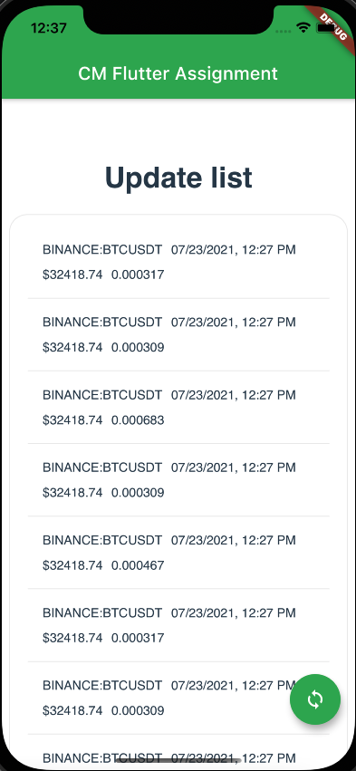
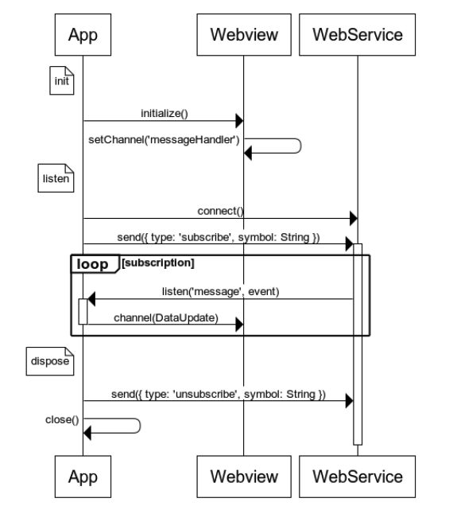

# CarbManager Flutter Assignment



## Getting Started

You will use a free API service called [Finnhub](https://finnhub.io/); you will need to generate an API Key for this purpose.

**When you submit your test you do not need to share your private key with us.**

## Recommendations

**About your process**

If your share your assignment from a git repository, please maintain your commit history. This will help us see your process.

**About the project design strategy**

You can use your own strategy or one of the following if you chose _(MVC, MVP, MVVM, etc)_. It is good idea to start easy and then make any refinements to reach the desired structure and outcome.

**About the state management**

Again, you can use your own state management or one of the following _(Lift state, ChangeNotifier, provider, BLoC, bloc, rxDart, etc)_. This assignment might not be the best case to implement any of them, but it shouldn't prevent you from showing off your beloved states skills!

## Explanation

The assignment is about creating a two-way communication between the app and a webview mounting the provided `html` file.

You will be connecting to the [Websocket Trades](https://finnhub.io/docs/api/websocket-trades) service from Finnhub, and send the retrieved Stock updates from the application to the webview.

## Sequence Diagram



## Step by step

- Store all app strings in a clean way of your choice
- Add a MaterialApp with an appBar with the following title: "CM Flutter Assignment"
- Setup a webview to load the html file located in `/assets/app.html`
- Create a channel called `appMessageHandler` to receive messages from the website
- Add support for sending messages to the website through the `nativeMessageHandler` function in provided html file. It has the following signature:

```
  nativeMessageHandler({
    action: 'APP_UPDATE_DATA',
    data: [
      {
        lastPrice: num;
        name: string;
        timestamp: DateFormat('MM/dd/yyyy - hh:mm a');
        volume: num;
      }
    ]
  });
```

- Setup and connect to `wss://ws.finnhub.io` websocket, providing it a configurable token (https://finnhub.io/docs/api/websocket-trades)
- Subscribe to a minimum of 5 symbols (you can search symbols here https://finnhub.io/docs/api/symbol-search)
- Listen to messages and send updates to the webview
- Add support for closing the websocket on app lifecycle

## Improvements

The following steps are not required to complete the assignment but add some value:

- Add a Floating Action Button with a refresh icon. Whenever it is clicked it will send updates to the webview, meaning that all the updates will be stored in the app until the button is clicked.
  The following action can be used to reset the content of the website:

```
  nativeMessageHandler({
    action: 'APP_RESET',
  });
```

- Move the socket listening to a new isolate, and send data only when the Action button is clicked.

## You do not need to send your API Key, we will use our own

## Please send us your test either through a git repository link or a zip file if you feel that is appropriate.

## If you have any questions please be sure to contact us for clarity.


